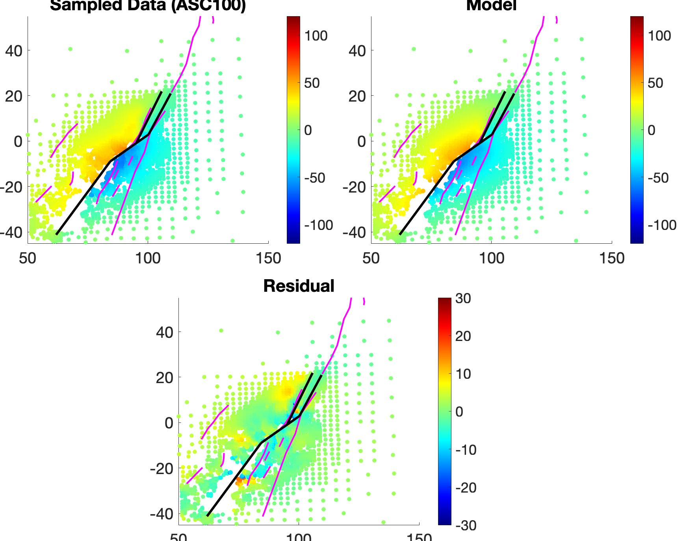
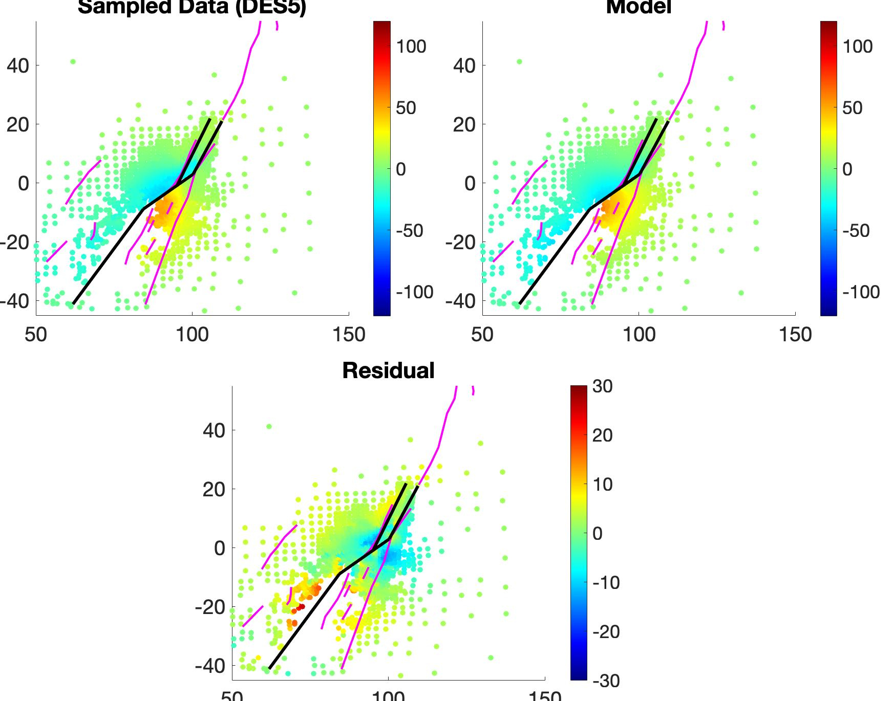

# geodetic_inversion (SlipSolve)
This repo homogeneous/layered inversion using InSAR/GPS

New: currently the repo also supports non-linear fault construction and inversion!


## References:

(Please cite those works if using our codes)

Jin, Z., & Fialko, Y. (2020). Finite slip models of the 2019 Ridgecrest earthquake sequence constrained by space geodetic data and aftershock locations. Bull. Seism. Soc. Am., 110, 1660–1679.

Jin, Z., & Fialko, Y. (2021). Coseismic and early postseismic deformation due to the 2021 M7. 4 Maduo (China) earthquake. Geophysical Research Letters, 48(21), e2021GL095213.

Jia, Z., Jin, Z., Marchandon, M., Ulrich, T., Gabriel, A. A., Fan, W., ... & Fialko, Y. (2023). The complex dynamics of the 2023 Kahramanmaraş, Turkey, M w 7.8-7.7 earthquake doublet. Science, 381(6661), 985-990.

Jin, Z., Fialko, Y., Yang, H., & Li, Y. (2023). Transient deformation excited by the 2021 M7. 4 Maduo (China) earthquake: Evidence of a deep shear zone. Journal of Geophysical Research: Solid Earth, 128(8), e2023JB026643.

---
## Step 1 ~ 2 are written in the file `main_detrend_inversion.m`
### Step 0: setup your MATLAB, CSHELL and GMT paths.
Please include the MATLABPATH for all directories.


### Step 1: data cleaning using `clean_insar_data.m`
```MATLAB
% remove some near-field unwrapping errors manually first
clean_insar_data; 
```
If you open `clean_insar_data.m`, you need to specify following information to clean the data:
- `this_track`: the directory that InSAR grid file is saved.
- `insar_file = 'unwrap_ll.grd'`: the interferogram/offsets grid
- `mask_file = 'mask_txt'`: the masking TXT file that writes the masking polygon files (e.g. mask1.txt, mask2.txt, ...). 
The masking polygons could be generated using Google Earth KML files.

Then the subroutine runs as (inside clean_insar_data.m):
``` MATLAB
% scale = -lambda / 4 / pi
% scale = -4*pi if the insar_file is an offset grid
% los_max is used just for plot (cm)
% detrend = 1 means that you apply for a detrend with the topography
mask_insar_phase(this_track, insar_file, mask_file, scale, 'los_max', 80, 'detrend', 0);
```
This step would output a subsampled grid file called "unwrap_clean_sample.grd", in 100 meters resolution as default.

### (Optional & New) using mask_insar_data.m to interactively mask out noisy pixels
You can directly run the mask_insar_data.m in order to interactively, manually apply masks and sign masks to remove the noisy pixels instead of running the clean_insar_data.m and sign_mask_offset.m

### Step 2: detrend the phase and remove the phase ambiguity
There are several ways to detrend the data. You can try them to see which one works the best for you. \
If we have enough far-field GPS data, we could use those GPS data to invert a coarse slip model to detrend the unwrapped phase. \
In cases such as Pamir and Qinghai earthquake, since we do not have enough GPS sites covered, we could just assume a far-field pixel that corresponds to zero displacement.
```MATLAB
% grdin = '/Users/zej011/coseismic/DES5/LOS2/unwrap_clean_sample.grd';
% grdout = '/Users/zej011/coseismic/DES5/LOS2/los_clean_detrend.grd';
% lonf = 73.215150;   latf = 37.754558;  (lonf/latf is the coordinate of pixel point)
% ref_lon = 71;  lonc = 72;  latc = 38.5;  (lonc/latc is the coordinate of reference point (0,0))
% threshold = 0.5; (pixels within 500m would be averaged in order to get the value at that point)
remove_ref_from_grid(grdin,grdout,lonf,latf,ref_lon,threshold);
```
- `grdin`: InSAR grid input
- `grdout`: InSAR grid output
- `lonf/latf`: reference lon/lat to convert lon/lat to UTM coordinates (m or km)
- `ref_lon`: central meridian to compute UTM coordinates: This parameter is necessary because UTM coordinates are generally confined within a single UTM zone.
If your study area crosses two different UTM zones, it would be complicated to convert to the UTM coordinates at the UTM zone boundary directly. 
So we shift the central meridian to the west (ref_lon), so that you could define a broader UTM zone than the common one. Usualy choose a ref_lon <= lonc.

Alternatively, you can try to fit a ramp to the data to detrend it
```MATLAB
[ramp,cffs]=deramp_xyz[Z,X,Y,code]
```
or fit a ramp to the residuals of an initial inversion, and subtract it from the data to produce the deramped data
```MATLAB
deramp_from_residuals.m
```


### (Optional) apply the sign mask for the detrended offset data
Because offset data are noisy than phase ones, sometimes you even need to apply a sign mask across the fault.
In each directory (this_track), just put two polygons named with clean_left.txt and clean_right.txt that surround the left and right part of the offset map.
```MATLAB
cd(this_track);
movefile los_clean_detrend.grd los_clean_unmask.grd
sign_mask_offset(this_track, 'los_clean_unmasked.grd');
```


---
## Step 3 ~ 7 are written in the file `main_detrend_inversion.m`
### Step 3: apply quad-tree sampling to all detrended data (LOS/RNG/AZO)
- `fault_file`: file that writes linearized fault segments (Format: lon1  lat1  lon2  lat2, each pair corresponds to one fault end). The fault file can be obtained via 1) local fault database 2) manually tracing the fault coordinate from remote-sensing data. You can use the function 'fitPiecewiseLine.m' to construct fault segments from the curved surface trace coordinate data.
- `area = [71.8 73.9 37.7 39.1]`: rectangular area that crops the InSAR grid file
- `los_list`: list of InSAR directories that are to be downsampled (Format: this_track, number_of_sampled_points(e.g.,3000))
- `Nmin = 2`: Minimum size of points to be averaged (Nmin x Nmin).
- `Nmax = 400`: Maximum size of points to be averaged (Nmax x Nmax).
```MATLAB
make_insar_data(los_list, Nmin, Nmax, 'method', 'quadtree', 'fault', fault_file, 'ref_lon', ref_lon, 'area', area, 'lonc', lonc, 'latc', latc);
```
**Note: If your minimum size of slip patch is 1km, your smallest resolution cell is 300m * 300m, that is, you should keep at least 3 points within one patch
distance in order to catch the curve gradient**


### Step 4: build the fault geometry
-  ## Sometimes, little prior knowledge of the fault is available (length, depth, dipping angles, location, etc.), so it is beneficial to use an [MCMC Bayesian Inversion](https://github.com/evavra/pyffit) to pin it down.

- `fault_file`: The fault ID is counted based on the order of fault segments written in `fault_file`, all fault segments have a default dip angle of 90 degrees.
This file is same as the one in Step 3. The fault file can be obtained via 1) local fault database 2) manually tracing the fault coordinate from remote-sensing data. You can use the function 'fitPiecewiseLine.m' to construct fault segments from the curved surface trace coordinate data.
- `dip_change_id = 1:5`: The array of fault IDs that have dip angles **NOT** equal to 90 degrees.
- `dip_angle = [87.7, 81.8, 85, 89.3, 89.3]`: The array of dip angles that are consistent with the array of `dip_change_id`.
- `len_top = 1.2e3`: The top length of each fault patch
- `l_ratio = 1.3 % (default)`: len(this_layer) / len(top_layer), follow a geometric progression
- `w_ratio = 1.3 % (default)`: width(this_layer) / width(top_layer), follow a geometric progression
- `width = 25e3 (default)`: The width of the whole fault plane
- `depth_start = 0 (default)`: The top depth of the fault plane. Default fault ruptures to surface.
```MATLAB
slip_model_vs = load_fault_one_plane(fault_file,'dip_change_id',dip_change_id,'dip',dip_angle, ...
                                     'lonc',72,'latc',38.5,'ref_lon',71,'len_top',1.2e3);
slip_model_ds = [];
```
- `slip_model_vs`: contains several rectangular fault planes
- `slip_model_ds`: set empty for most cases, because it's used to construct the geometry of "Y shape" or "flower structure" formed by shallow splay faults.


### Step 5: inversion using first downsampled data
- `iter_step`: The steps during the iterative sampling and inversion (=0: initial step;  =1: iterative sampling/inversion)
- `shallow_dip_id`: The fault IDs of shallow splay faults, set empty for most cases
- `segment_smooth_file`: The continuity between each fault plane (format: fault_ID1, left/right, fault_ID2, right/left. 
The starting point of the fault is presumed as "left")
- `intersect_smooth_file = []`: The continuity between splay faults and major fault planes, set empty for most cases.
- `fault_file`: Same as above
- `model_type = okada % (default)`: Okada or layered model
```MATLAB
iter_step = 0;
segment_smooth_file = 'seg_connect';
intersect_smooth_file = [];
[slip_model,~,~] = make_fault_from_insar(slip_model_vs,slip_model_ds,iter_step,'shallow_dip_id',[], ...
                  'segment_smooth_file',segment_file,'intersect_smooth_file',intersect_file,'fault',fault_file, ...
                  'lonc',72,'latc',38.5,'ref_lon',71,'model_type','okada');
```


### Step 6: iterative sampling data using the model predictions (Wang and Fialko, GRL 2015)
```MATLAB
iter_step = 1;  % usually just one iteration is enough to rule out samples on noisy pixels
resamp_insar_data(los_list, Nmin, Nmax, iter_step, 'fault', fault_file, 'dec',2, 'lonc',72, 'latc',38.5, 'ref_lon',71);
```
- `dec`: decimation of grid files, default value is 1.
- All other parameters are the same as Step 3.


### Step 7: inversion using resampled data
```MATLAB
[slip_model,rms,model_roughness] = make_fault_from_insar(slip_model_vs,slip_model_ds,iter_step, ...
                     'segment_smooth_file',segment_file,'intersect_smooth_file',intersect_file,'fault',fault_file, ...
                     'lonc',72,'latc',38.5,'ref_lon',71);
```
Tha parameters are the same as Step 5.

---
**Note: The model geometry of each patch is defined as follows:**

                   N
                  /
                 /| strike
         Ref:-> @------------------------E
                |\        p .            \ W
                :-\      i .              \ i
                |  \    l .                \ d
                :90 \  S .                  \ t
                |-dip\  .                    \ h
                :     \. | rake               \ 
               -Z      -------------------------
                              L e n g t h

`slip_model` is a matrix that defines the model parameters:
1. Fault segment index
2. Fault patch index
3. Number of patches in this layer
4. X(Ref) of each rectangular patch (East is positive)
5. Y(Ref) of each rectangular patch (North is positive)
6. Z(Ref) of each rectangular patch (Up is positive)
7. Along-strike length of each patch
8. Down-dip length of each patch
9. Strike angle of each patch
10. Dip angle of each patch
11. Topography on the top surface of each patch
12. Strike-slip of each patch (default is cm)
13. Dip-slip of each patch (default is cm)

**The plot of model in the example is displayed as follows:**



